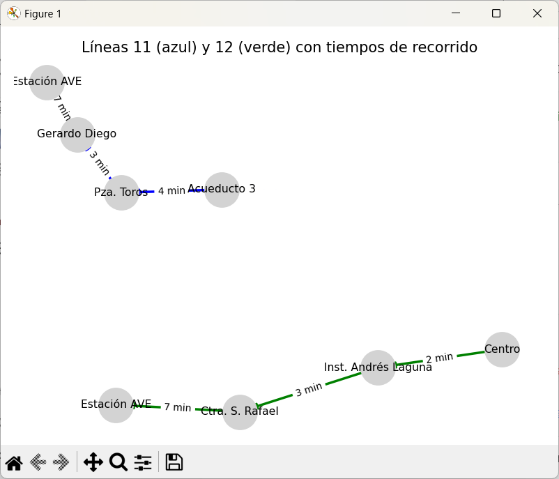
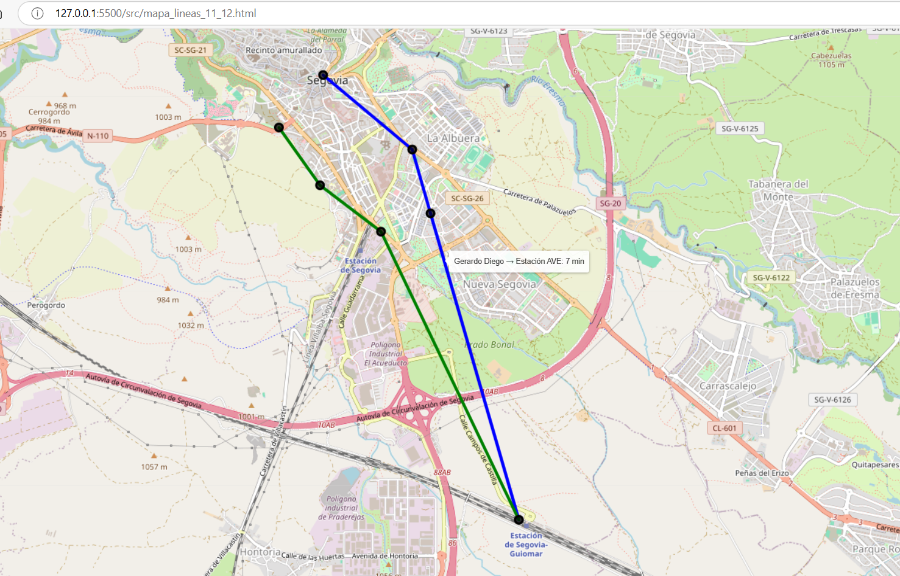

# Modelo 2

En este segundo modelo se busca cumplir el Objetivo 1 del proyecto:

Objetivo 1: Construir un grafo representativo de la red de transporte urbano de Segovia.
•	Tarea 1.1: Recopilar las coordenadas de las paradas de autobús y la estación de tren.
•	Tarea 1.2: Identificar las conexiones entre paradas (por recorrido de líneas o proximidad geográfica).
•	Tarea 1.3: Diseñar la estructura de nodos y aristas (grafo dirigido o no dirigido, ponderado por distancia o tiempo).
•	Tarea 1.4: Implementar el grafo en una estructura compatible con GNNs (PyTorch Geometric, DGL, etc.).

Los 4 objetivos se han cumplido de forma satisfactoria.

## Grafo con las dos líneas y sus tiempos representadas de forma independiente en una figura

## Grafo con las dos líneas y sus tiempos representadas por sus coordenadas

